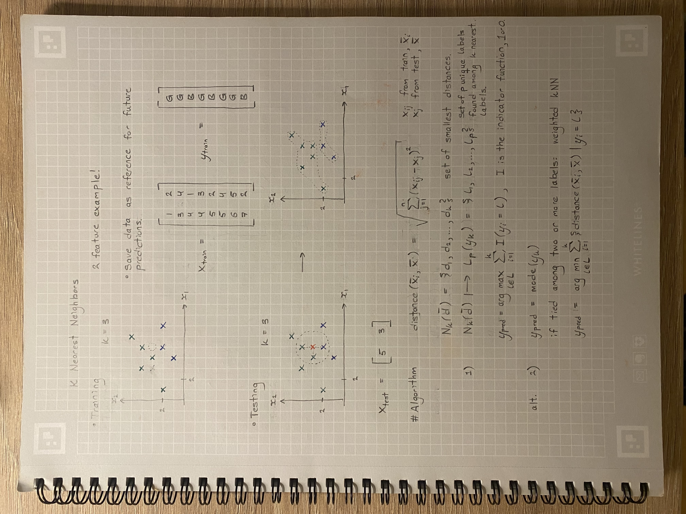
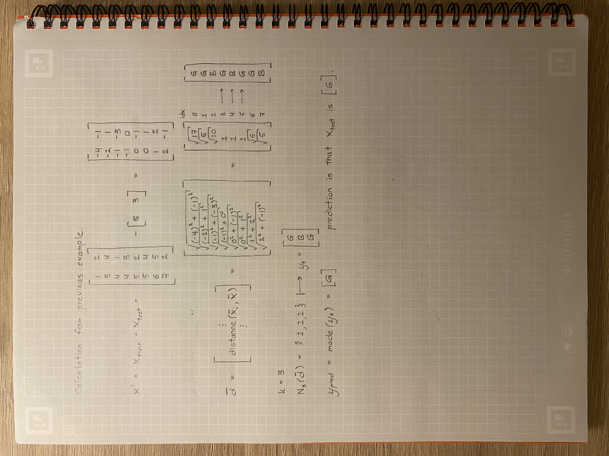

## K Nearest Neighbors
___
by: __Oskar Edén Wallberg__  

K Nearest Neighbors (KNN or k-NN) is a:
- non-parametric
- supervised
- classification
- proximity based
algorithm.  

Typically kNN is used for clustering, e.g. customer segmentation.

### Algorithm
Given a datapoint
- Calculate the euclidean distance to all other points
- Sort list of distances in ascending order (proximity)
- Get the k nearest training points and respective labels
- Prediction is given by mode of those k labels (majority vote)
- If tied, use weighted kNN:
    *  Select mode with shortest average distance among points

### Notes
___

p.1
___

p.2

